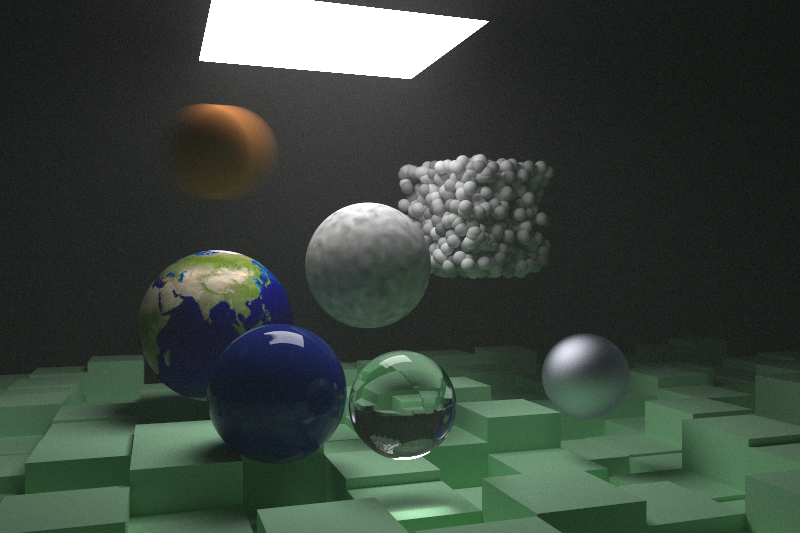

# Ray Tracing in One Weekend in Rust

This is an implementation of [Ray Tracing in One Weekend](https://raytracing.github.io/books/RayTracingInOneWeekend.html) in Rust.

To run use: 

```
cargo run --release
```

and wait for the pretty picture to generate!

## Renders

Here are some renders: 




